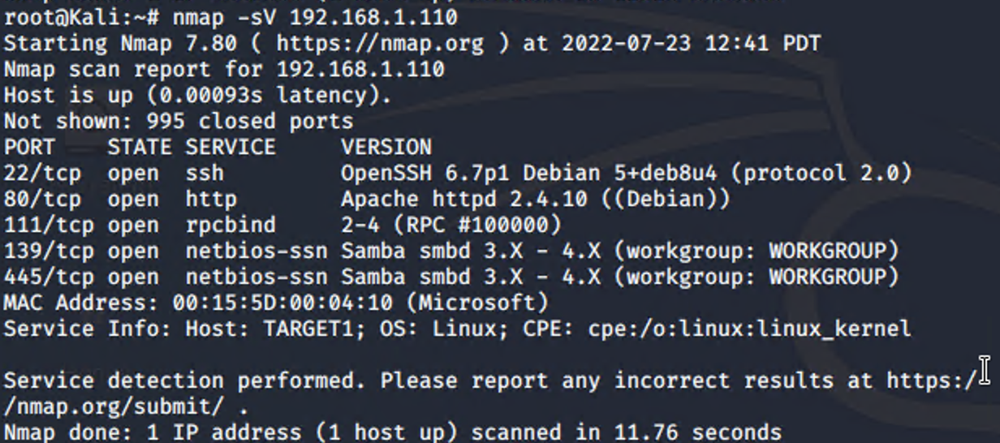
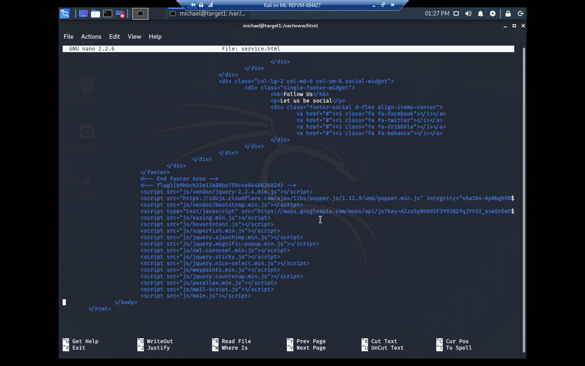
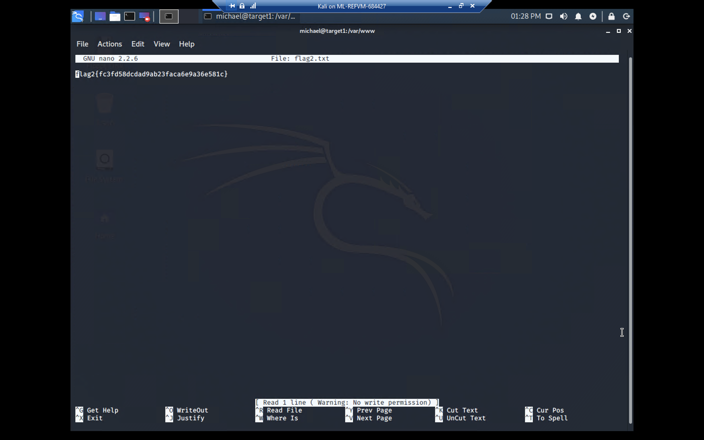

# Red Team: Summary of Operations

## Table of Contents
- Exposed Services
- Critical Vulnerabilities
- Exploitation

### Exposed Services


Nmap scan results for each machine reveal the below services and OS details:



```bash
$ nmap -sV 192.168.1.110
```

- This scan identifies the services below as potential points of entry:
- Target 1
	- Port 22/tcp open ssh (service) OpenSSH 6.7p1 Debian 5+deb8u4
	- Port 80/tcp open http (service) Apache httpd 2.4.10 ((Debian))
	- Port 111/tcp open rpcbind (service) 2-4 (RPC #100000)
	- Port 139/tcp open netbios-ssn (services) Samba smbd 3.X - 4.X
	- Port 445/tcp open netbios-ssn (services) Samba smbd 3.X - 4.X

- The following vulnerabilities were identified on each target:
- Target 1
	- CVE-2021-28041 open SSH
	- CVE-2017-15710 Apache https 2.4.10
	- CVE-2017-8779 exploit on open rpcbind port could lead to remote DoS
	- CVE-2017-7494 Samba NetBIOS
###Critical Vulnerabilities

- The following vulnerabilities were identified on Target 1:

- Network Mapping and User Enumeration (WordPress site)
	- Nmap was used to discover open ports.
		- Able to discover open ports and tailor their attacks accordingly.
- Weak User Password
	- A user had a weak password and the attackers were able to discover it by guessing.
		- Able to correctly guess a user's password and SSH into the web server.
- Unsalted User Password Hash (WordPress database)
	- Wpscan was utilized by attackers in order to gain username information.
		- The username info was used by the attackers to help gain access to the web server.
- MySQL Database Access
	- The attackers were able to discover a file containing login information for the MySQL database.
		- Able to use the login information to gain access to the MySQL database.
- MySQL Data Exfiltration
	- By browsing through the various tables in the MySQL database the attackers were able to discover password hashes of all the users.
		- The attackers were able to exfiltrate the password hashes and crack them with John the Ripper.
- Misconfiguration of User Privileges/Privilege Escalation
	- The attackers noticed that Steven had sudo privileges for python.
		- Able to utilize Steven’s python privileges in order to escalate to root.
### Exploitation


The Red Team was able to penetrate `Target 1` and retrieve the following confidential data:

- Target 1
  - `flag1.txt`: flag1{b9bbcb33e11b80be759c4e844862482d}
  - 
    - **Exploit Used**
      - ssh into Michael’s account and look in the/var/www files
      - ssh michael@192.168.1.110
      - cd /var/www/html
      - nano service.html
      - flag 1 : flag1{b9bbcb33e11b80be759c4e844862482d}
  - `flag2.txt`: flag2{fc3fd58dcdad9ab23faca6e9a36e581c}
  - 
    - **Exploit Used**
      - ssh into Michael’s account and look in the /var/www files
      - cd /var/www
      - ls -la
      - cat flag2.txt
